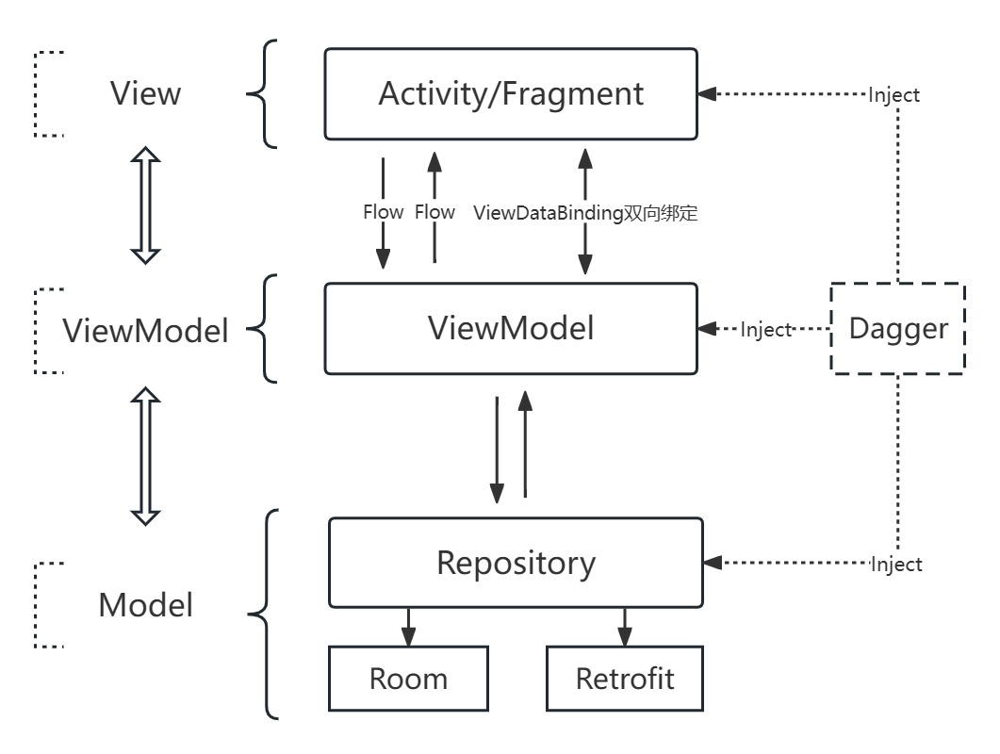

# MVVMFrame


[](https://raw.githubusercontent.com/jenly1314/MVVMFrame/master/app/release/app-release.apk)
[](https://repo1.maven.org/maven2/com/github/jenly1314/mvvmframe)
[](https://bintray.com/beta/#/jenly/maven/mvvmframe)
[](https://jitpack.io/#jenly1314/MVVMFrame)
[](https://circleci.com/gh/jenly1314/MVVMFrame)
[](https://android-arsenal.com/api?level=21)
[](https://opensource.org/licenses/mit-license.php)

MVVMFrame for Android 是一个基于Google官方推出的Architecture Components dependencies（现在叫JetPack）构建的快速开发框架。有了 **MVVMFrame** 的加持，从此构建一个 **MVVM** 模式的项目变得快捷简单。

## 架构


## 引入

### Gradle：

1. 在Project的 **build.gradle** 或 **setting.gradle** 中添加远程仓库

   ```gradle
    repositories {
        //...
        mavenCentral()
        maven { url 'https://jitpack.io' }
    }
   ```

2. 在Module的 **build.gradle** 里面添加引入依赖项
   ```gradle
   // AndroidX
   implementation 'com.github.jenly1314:mvvmframe:3.0.0'
   ```

### **Hilt**和 **Room** 的相关注解处理器

   因为 [mvvmframe](mvvmframe) 内部依赖了 **Hilt** 和 **Room**，所以你需要引入下面列出的编译时的注解处理器，用于自动生成相关代码。

> 以下配置为当前最新版本的，其它对应版本可查看版本说明，或对应的版本发布 [Versions](https://github.com/jenly1314/MVVMFrame/releases)

> 如果你使用**v2.x** 版本的话，请直接 [查看2.x分支版本](https://github.com/jenly1314/MVVMFrame/tree/2.x)

你需要在项目根目录的 **build.gradle** 文件中配置 **Hilt** 的插件：
```gradle
plugins {
    //...
    id 'com.google.dagger.hilt.android' version '2.51' apply false
}
```
接下来，在 **app/build.gradle** 文件中，引入 **Hilt** 的插件和相关依赖：

```gradle
plugins {
    //...
    id 'kotlin-kapt'
    id 'com.google.dagger.hilt.android'
}

dependencies{
    //...

    // hilt
    implementation "com.google.dagger:hilt-android:2.51"
    kapt "com.google.dagger:hilt-compiler:2.51"

    // room
    kapt "androidx.room:room-compiler:2.6.1"
}

```

> `kapt`适用于kotlin项目，如果你的项目使用的java，请使用`annotationProcessor` 替代 `kapt`

## 使用

### 版本特别说明

* 3.x版本统一改为使用`kotlin`并进行了重构；之前2.x版本内部使用的`LiveData`相关代码已全部移除，3.x版本已全部改用kotlin独有的`Flow`进行实现。

* 3.x相比较于2.x版本更为精简，可定制性更高。（如果需要在`Compose`中进行使用，只需加上`Compose`的UI相关依赖，稍微封装下即可）

> 建议在新项目中使用；如果你之前使用的是2.x旧版本，请谨慎升级。

> 如果你使用**v2.x** 版本的话，请直接 [查看2.x分支版本](https://github.com/jenly1314/MVVMFrame/tree/2.x)

---

> 从分割线此处开始，以下全部为3.x版本相关说明

### 集成步骤代码示例 （完整示例，可直接查看[app](app)）

**Step.1** 启用ViewDataBinding，在你项目中的build.gradle的android{}中添加配置：

```gradle
buildFeatures{
    dataBinding = true
}
```

**Step.2** 使用JDK17编译，在你项目中的build.gradle的android{}中添加配置：
```gradle
compileOptions {
    targetCompatibility JavaVersion.VERSION_17
    sourceCompatibility JavaVersion.VERSION_17
}

```

**Step.3** 自定义全局配置(继承MVVMFrame中的FrameConfigModule)（提示：如果你没有自定义配置的需求，可以直接忽略此步骤）
```kotlin
/**
 * 全局配置
 */
class AppConfigModule : FrameConfigModule() {
    override fun applyOptions(context: Context, builder: ConfigModule.Builder) {
        // 通过第一种方式初始化BaseUrl
        builder.baseUrl(Constants.BASE_URL) // TODO 配置Retrofit中的baseUrl

        builder.retrofitOptions(object : RetrofitOptions {
            override fun applyOptions(builder: Retrofit.Builder) {
                // TODO 配置Retrofit
            }
        })
            .okHttpClientOptions(object : OkHttpClientOptions {
                override fun applyOptions(builder: OkHttpClient.Builder) {
                    // TODO 配置OkHttpClient
                }
            })
            .gsonOptions(object : GsonOptions {
                override fun applyOptions(builder: GsonBuilder) {
                    // TODO 配置Gson
                }
            })
            .roomDatabaseOptions(object : RoomDatabaseOptions {
                override fun applyOptions(builder: RoomDatabase.Builder<out RoomDatabase>) {
                    // TODO 配置RoomDatabase
                }
            })
            .configOptions(object : AppliesOptions.ConfigOptions {
                override fun applyOptions(builder: Config.Builder) {
                    // TODO 配置Config
                    builder.httpLoggingLevel(HttpLoggingInterceptor.Level.BODY)
                }
            })
    }
}
```

然后在你项目中的AndroidManifest.xml中通过配置meta-data来自定义全局配置（提示：如果你没有自定义配置的需求，可以直接忽略此步骤）
```xml
<!-- MVVMFrame 全局配置 -->
<meta-data android:name="com.king.mvvmframe.config.AppConfigModule"
           android:value="FrameConfigModule"/>
```
> 此处的`com.king.mvvmframe.config.AppConfigModule` 替换为你自定义的全局配置类

**Step.4** 配置Application

```kotlin
 @HiltAndroidApp
 class YourApplication : BaseApplication() {
    //...

    override fun onCreate() {
        super.onCreate()
        // 如果你没有使用FrameConfigModule中的第一中方式初始化BaseUrl，也可以通过第二种方式来设置BaseUrl（二选其一即可）
//        RetrofitHelper.getInstance().setBaseUrl(baseUrl)
    }
 }
```
> 如果由于某种原因，导致你不能继承`BaseApplication`；你也可以在你自定义的`Application`的`onCreate`函
 数中通过调用`BaseApplication.initAppConfig`来进行初始化。

### 其他

### 关于使用 **Hilt**

**Hilt** 是JetPack中新增的一个依赖注入库，其基于**Dagger2**研发（后面统称为Dagger），但它不同于Dagger。对于Android开发者来说，Hilt可以说专门为Android 打造。

之前使用的**Dagger for Android**虽然也是针对于Android打造，也能通过 **@ContributesAndroidInjector** 来通过生成简化一部分样板代码，但是感觉还不够彻底。因为 **Component** 层相关的桥接还是要自己写。**Hilt**的诞生改善了这些问题。

**Hilt** 大幅简化了**Dagger** 的用法，使得我们不用通过 **@Component** 注解去编写桥接层的逻辑，但是也因此限定了注入功能只能从几个 **Android** 固定的入口点开始。

#### **Hilt** 目前支持以下 **Android** 类：

* Application（通过使用 @HiltAndroidApp）
* ViewModel（通过使用 @HiltViewModel）
* Activity
* Fragment
* View
* Service
* BroadcastReceiver

**Application** 示例 (这里我们使用BaseApplication)
```kotlin
@HiltAndroidApp
class YourApplication : BaseApplication() {
    //...
}
```

**ViewModel** 示例 (这里我们使用BaseViewModel)
```kotlin
@HiltViewModel
class YourViewModel : BaseViewModel() {
    //...
}
```

其他的入口点，都是用 **@AndroidEntryPoint** 注解来声明，示例如下

**Activity** 示例 (这里我们使用BaseActivity)
```kotlin
@AndroidEntryPoint
class YourActivity: BaseActivity() {
    //...
}
```

**Fragment** 示例 (这里我们使用BaseFragment)
```kotlin
@AndroidEntryPoint
class YourFragment: BaseFragment() {
    //...
}
```
> 其他入口点都基本类似，不再一一列举了。更多有关 **Hilt** 的使用说明，可以查看官方的[Hilt使用指南](https://developer.android.google.cn/training/dependency-injection/hilt-android)。

### 关于设置 **BaseUrl**

> 目前通过设置 BaseUrl 的入口主要有两种：
>> 1.一种是通过在 Manifest 中配置 meta-data 的来自定义 FrameConfigModule,在里面 通过 {@link ConfigModule.Builder#baseUrl(String)}来配置 BaseUrl。（一次设置，全局配置）
>
>> 2.一种就是通过RetrofitHelper {@link RetrofitHelper#setBaseUrl(String)} 或 {@link RetrofitHelper#setBaseUrl(HttpUrl)} 来配置 BaseUrl。（可多次设置，动态全局配置，有前提条件）
>
> 以上两种配置 BaseUrl 的方式都可以达到目的。但是你可以根据不同的场景选择不同的配置方式。
>
> 主要场景与选择如下：
>
>> 一般场景：对于只使用单个不变的 BaseUrl的
>>>     场景1:如果本库的默认已满足你的需求，无需额外自定义配置的。
>          选择：建议你直接使用 {@link RetrofitHelper#setBaseUrl(String)} 或 {@link RetrofitHelper#setBaseUrl(HttpUrl)} 来初始化 BaseUrl，切记在框架配置初始化 BaseUrl之前，建议在你自定义的 {@link Application#onCreate()}中初始化。
>
>>>     场景2:如果本库的默认配置不满足你的需求，你需要自定义一些配置的。（比如需要使用 RxJava相关）
>          选择：建议你在自定义配置中通过 {@link ConfigModule.Builder#baseUrl(String)} 来初始化 BaseUrl。
>
>> 二般场景：对于只使用单个 BaseUrl 但是，BaseUrl中途会变动的。
>>>     场景3：和一般场景一样，也能分两种，所以选择也和一般场景也可以是一样的。
>          选择：两种选择都行，但当 BaseUrl需要中途变动时，还需将 {@link RetrofitHelper#setDynamicDomain(boolean)} 设置为 {@code true} 才能支持动态改变 BaseUrl。
>
>> 特殊场景：对于支持多个 BaseUrl 且支持动态可变的。
>>>        选择：这个场景的选择，主要涉及到另外的方法，请查看 {@link RetrofitHelper#putDomain(String, String)} 和 {@link RetrofitHelper#putDomain(String, HttpUrl)}相关详情


更多使用详情，请查看[app](app)中的源码使用示例或直接查看 [API帮助文档](https://jenly1314.github.io/MVVMFrame/api/)

## 混淆

 目前 **MVVFrame** 所有依赖混淆规则可参见：[ProGuard rules](mvvmframe/proguard-rules.pro)

## 相关推荐

#### [AppTemplate](https://github.com/jenly1314/AppTemplate) 一款基于**MVVMFrame**构建的App模板
#### [MVVMFrameComponent](https://github.com/jenly1314/MVVMFrameComponent) 一款基于**MVVMFrame**构建的组件化方案
#### [EasyChat](https://github.com/yetel/EasyChatAndroidClient) 一款即时通讯APP
#### [KingWeather](https://github.com/jenly1314/KingWeather)  一款天气预报APP
#### [EasyNote](https://github.com/jenly1314/EasyNote) 一款遵循 **Clean Architecture** 架构分层， 使用 **Jetpack Compose** 实现的笔记App

<!-- end -->

## 版本日志

#### v3.0.0：2024-03-03
* 统一改为使用`kotlin`，并进行了重构
* 移除所有`LiveData`相关代码改用`Flow`
* 更新编译SDK至34
* 更新Gradle至v8.0
* 新增core-ktx依赖（v1.12.0）
* 新增fragment-ktx依赖（v1.6.2）
* 新增lifecycle-ktx相关依赖（v2.7.0）
* 更新Okhttp至v4.12.0
* 更新Hilt至v2.51
* 更新Gson至v2.10.1
* 更新Room至v2.6.1
* 更新retrofit-helper至v1.1.0

#### v2.2.1：2022-04-21
* 更新Okhttp至v4.9.3
* 更新Hilt至v2.41
* 更新Gson至v2.9.0

#### [查看更多版本记录](CHANGELOG)

## 赞赏
如果你喜欢MVVMFrame，或感觉MVVMFrame帮助到了你，可以点右上角“Star”支持一下，你的支持就是我的动力，谢谢 :smiley:
<p>您也可以扫描下面的二维码，请作者喝杯咖啡 :coffee:

<div>
   
</div>

## 关于我

| 我的博客                                                                                | GitHub                                                                                  | Gitee                                                                                  | CSDN                                                                                 | 博客园                                                                            |
|:------------------------------------------------------------------------------------|:----------------------------------------------------------------------------------------|:---------------------------------------------------------------------------------------|:-------------------------------------------------------------------------------------|:-------------------------------------------------------------------------------|
| <a title="我的博客" href="https://jenly1314.github.io" target="_blank">Jenly's Blog</a> | <a title="GitHub开源项目" href="https://github.com/jenly1314" target="_blank">jenly1314</a> | <a title="Gitee开源项目" href="https://gitee.com/jenly1314" target="_blank">jenly1314</a>  | <a title="CSDN博客" href="http://blog.csdn.net/jenly121" target="_blank">jenly121</a>  | <a title="博客园" href="https://www.cnblogs.com/jenly" target="_blank">jenly</a>  |

## 联系我

| 微信公众号        | Gmail邮箱                                                                          | QQ邮箱                                                                              | QQ群                                                                                                                       | QQ群                                                                                                                       |
|:-------------|:---------------------------------------------------------------------------------|:----------------------------------------------------------------------------------|:--------------------------------------------------------------------------------------------------------------------------|:--------------------------------------------------------------------------------------------------------------------------|
| [Jenly666](http://weixin.qq.com/r/wzpWTuPEQL4-ract92-R) | <a title="给我发邮件" href="mailto:jenly1314@gmail.com" target="_blank">jenly1314</a> | <a title="给我发邮件" href="mailto:jenly1314@vip.qq.com" target="_blank">jenly1314</a> | <a title="点击加入QQ群" href="https://qm.qq.com/cgi-bin/qm/qr?k=6_RukjAhwjAdDHEk2G7nph-o8fBFFzZz" target="_blank">20867961</a> | <a title="点击加入QQ群" href="https://qm.qq.com/cgi-bin/qm/qr?k=Z9pobM8bzAW7tM_8xC31W8IcbIl0A-zT" target="_blank">64020761</a> |

<div>
   
</div>


